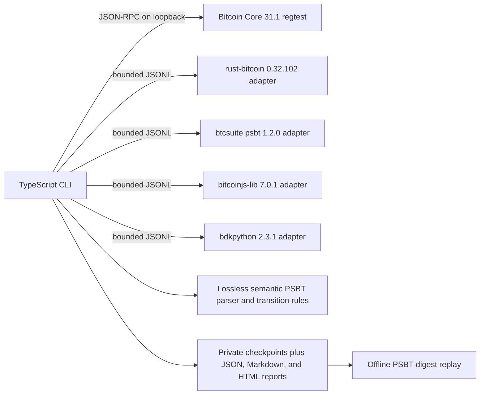

# Architecture

## Design Goal

The proof suite answers one concrete question: can several real Bitcoin implementations hand the same PSBT
to one another and still produce a transaction that Bitcoin Core can finalize and accept under
policy? It does not reimplement wallet logic in TypeScript. The orchestrator controls the run while
each native library parses and acts on the PSBT itself.

## Components

### TypeScript orchestrator

The CLI owns scenario order, Core RPC, adapter lifecycle, strict request and response validation,
timeouts, result classification, artifact writing, and replay. TypeScript is used for developer
experience and orchestration; no signature algorithm is implemented there.

For every adapter round trip, `assertByteIdenticalRoundtrip` in `src/scenarios/contracts.ts` parses
the source and returned canonical PSBT and compares decoded bytes independently of the adapter's
`byteIdentical` claim. `CoreRpc.call` in `src/core/rpc.ts` requires matching JSON-RPC request/response
IDs, and fixture preparation requires Bitcoin Core numeric version `310100`.

### Bitcoin Core fixture source and oracle

Core 31.1 mines a local regtest chain, funds the known public P2WSH descriptor, creates PSBTv0 with
`createpsbt`, and fills UTXO/script metadata with `utxoupdatepsbt`. At the end of each path,
`finalizepsbt` extracts the transaction and `testmempoolaccept` checks current consensus and mempool
policy without broadcasting it.

The Core RPC `version` argument to `createpsbt` is the unsigned transaction version. It is not the
PSBT format version. The generated fixture is inspected as PSBTv0 before any adapter receives it.

### Native adapters

Adapters speak `psbt-lab.adapter/0.2`, one JSON object per line. Every response repeats the request
ID and includes implementation name, version, and artifact digest. The status is one of `ok`,
`unsupported`, `rejected`, `crashed`, or `timeout`; failures use stable error classes rather than
language-specific stack traces.

Startup pins each adapter's self-reported name, version, source revision, operations, and PSBTv0
support as a compatibility check. A malicious adapter can spoof the expected identity strings and
supply any schema-valid self-reported digest; the runner does not compare a pinned content digest.
These values are not cryptographic attestation of the running image. Dockerfile base digests,
downloaded checksums, and dependency hashes support reproducible build selection rather than
runtime provenance.

The Rust, Go, and JavaScript adapters sign and finalize only known run-committed fixture inputs.
The Python adapter freezes the affected `bdkpython` 2.3.1 wheel and exposes round-trip/finalize
behavior. No adapter has network access at runtime.

### Wire facts and artifacts

The wire-facts parser reads BIP174/BIP370 framing directly so serialization changes cannot be
hidden by a library's normalized object model. It records PSBT version, byte length, SHA256, map
counts, and key/value sizes. Raw PSBT, script, and UTXO material is excluded from reports.
Implementation name, version, source revision, and self-reported digest metadata are intentionally
recorded and protected only by local file permissions.

Each handoff writes both the canonical base64 PSBT and its facts. The manifest records these files
alongside the run's self-reported implementation identities. Replay reparses each PSBT and verifies
its SHA256 against the manifest and stored facts JSON `sha256`; it does not recompute other stored
facts or recorded outcomes and does not rerun adapters. This does not authenticate the mutable
artifact directory.

Replay rejects absolute and lexically escaping checkpoint paths and caps a manifest at 1,000
checkpoints. Intermediate symlinks remain trusted. Final-component `O_NOFOLLOW` protection applies
only where Node exposes the flag.

## Runtime And CI Boundaries

Locally, one trusted developer controls the host account and Docker daemon. Core and all adapters
run with read-only roots, dropped capabilities, process/memory limits, and `no-new-privileges`; Core
alone retains its named regtest data volume and a bounded temporary `/tmp` mount. Adapters use no
network, while Core JSON-RPC is published only to host loopback. These settings reduce ordinary
process and resource exposure but do not protect against a compromised trusted host, Docker daemon,
kernel, or base image.

GitHub-hosted CI is separate from that runtime. `.github/workflows/ci.yml` gives jobs read-only
repository permission, no persisted checkout credential or workflow secrets, pinned action commits,
ephemeral runners, timeouts, and concurrency cancellation. Pull requests run the TypeScript, Rust,
Go, JavaScript, and BDK checks; the complete Docker proof runs only on `refs/heads/main` or a trusted
manual dispatch.
These controls mitigate credential, compute, and network abuse. Pull-request code can alter its own
tests and build scripts, so green means revision self-consistency rather than independent check
integrity. The workflow does not publish or attest a release image.

The detailed assumptions, abuse paths, and residual risks are recorded in the
[threat model](../psbt-interop-lab-threat-model.md).

## Proof Scenarios

The executable catalog currently contains ten scenarios. Three independent Core-to-library handoffs
exercise rust-bitcoin, btcsuite, and bitcoinjs signing. A four-library chain proves byte-semantic
preservation across BDK, Rust, Go, and JavaScript. A parallel path has Rust sign input zero and Go
sign input one, then requires bitcoinjs to combine the union before Core accepts it.

The rejection matrix runs five malformed or undeclared PSBT cases through all four parsers. The
metadata scenario injects valid BIP174 proprietary entries into every global, input, and output map
and checks their preservation at each handoff. Three regression scenarios reproduce BDK issue #488
after Rust, Go, or JavaScript prepares the same mixed finalized/partial state; Core independently
finalizes and policy-checks the same PSBT.

`psbt-lab self-test` deliberately drops metadata, changes an output amount, changes an input
sequence, and removes a signature. It passes only when the semantic detectors identify every fault.

## Extension Points

New adapters can be added without changing scenario semantics. The extension interfaces are an
adapter conformance kit, a declarative scenario format, transition invariants, and a normalized diff
model. Implementations can then be compared by capability and version while raw PSBT bytes remain
the source of truth.
