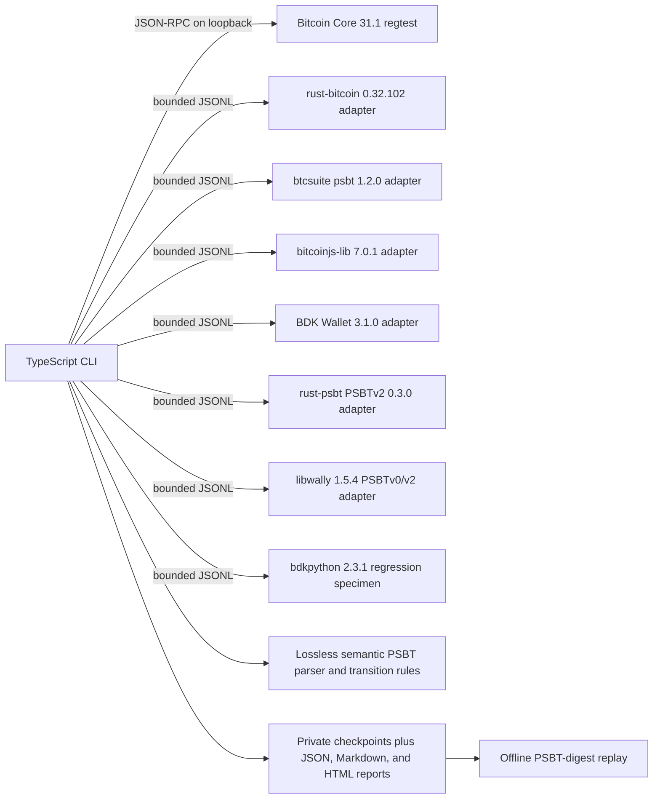

# Architecture

## Design Goal

The proof suite answers one concrete question: can several real Bitcoin implementations hand the same PSBT
to one another and still produce a transaction that Bitcoin Core can finalize and accept under
policy? It does not reimplement wallet logic in TypeScript. The orchestrator controls the run while
each native library parses and acts on the PSBT itself.

## Components

### TypeScript orchestrator

The CLI owns scenario order, Core RPC, adapter lifecycle, strict request and response validation,
timeouts, result classification, artifact writing, and replay. TypeScript is used for developer
experience and orchestration; no signature algorithm is implemented there.

Scenario and category selections are resolved before the runtime provider is created. Unknown or
empty selections therefore fail without starting Core, Docker, or adapter processes.

For every adapter round trip, `ScenarioExecutionContext.requireTransition` parses the source and
returned PSBT and applies the lossless `roundtrip` transition policy independently of the adapter's
`byteIdentical` claim. Legal map reordering is diagnostic rather than failure. `CoreRpc.call` in
`src/core/rpc.ts` requires matching JSON-RPC request/response IDs, and fixture preparation requires
Bitcoin Core numeric version `310100`.

### Bitcoin Core fixture source and oracle

Core 31.1 mines a local regtest chain and funds deterministic public P2WPKH, nested P2SH-P2WPKH,
single-key and 2-of-3 P2WSH, P2TR key-path, and P2TR script-path descriptors. It creates PSBTv0 with
`createpsbt` and fills UTXO/script metadata with `utxoupdatepsbt`. Intent fixtures add multiple
outputs, RBF sequence, non-zero locktime, explicit sighash type, and derivation metadata. At the
end of each signing path,
`finalizepsbt` extracts the transaction and `testmempoolaccept` checks current consensus and mempool
policy without broadcasting it.

The Core RPC `version` argument to `createpsbt` is the unsigned transaction version. It is not the
PSBT format version. The generated fixture is inspected as PSBTv0 before any adapter receives it.

### Native adapters

Adapters speak `psbt-lab.adapter/0.2`, one JSON object per line. Every response repeats the request
ID and includes implementation name, version, and artifact digest. The status is one of `ok`,
`unsupported`, `rejected`, `crashed`, or `timeout`; failures use stable error classes rather than
language-specific stack traces.

Startup pins each adapter's self-reported name, version, source revision, operations, and declared
PSBT-version support as a compatibility check. A malicious adapter can spoof the expected identity strings and
supply any schema-valid self-reported digest; the runner does not compare a pinned content digest.
These values are not cryptographic attestation of the running image. Dockerfile base digests,
downloaded checksums, and dependency hashes support reproducible build selection rather than
runtime provenance.

Hello capabilities declare script support per operation. This prevents broad parsing or signing
support from being interpreted as support for finalizing the same script type; scenarios with an
unsupported operation/script pair are reported as unsupported before execution.

The `native-parse` operation removes the adapter's PSBT structural preflight from invalid-input
testing. After bounded canonical base64 decoding, the Rust, Go, JavaScript, or Python adapter calls
the native library parser directly and reports whether that parser accepted or rejected the bytes.

The Rust, Go, JavaScript, current BDK, rust-psbt-v2, and libwally adapters sign and finalize only
known run-committed fixture inputs. rust-psbt-v2 and libwally both exercise the official BIP370
corpus and run bidirectional PSBTv2 signing/finalization workflows. The Python adapter freezes the affected `bdkpython` 2.3.1 wheel and exposes
round-trip/finalize behavior. No adapter has network access at runtime.

### Wire facts and artifacts

The wire-facts parser reads BIP174/BIP370 framing directly so serialization changes cannot be
hidden by a library's normalized object model. It records PSBT version, byte length, SHA256, map
counts, and key/value sizes. Raw PSBT, script, and UTXO material is excluded from reports.
Implementation name, version, source revision, and self-reported digest metadata are intentionally
recorded and protected only by local file permissions.

Roundtrip checks preserve every field except one BIP370 equivalence: an omitted
`PSBT_GLOBAL_TX_MODIFIABLE` field and an explicit one-byte zero value both mean that no inputs or
outputs may be changed. The checker accepts only that missing-to-zero or zero-to-missing
normalization. Nonzero flags, any other addition/removal, and every value mutation still fail.
Signing, combining, and finalization additionally allow only BIP370-monotonic flag changes:
input/output modification permissions may be cleared, the sighash-single bit may only be set, and
unknown bits must remain unchanged.

Each handoff writes both the canonical base64 PSBT and its facts. The manifest records these files
alongside the run's self-reported implementation identities. Replay reparses each PSBT and verifies
its SHA256 against the manifest and stored facts JSON `sha256`; it does not recompute other stored
facts or recorded outcomes and does not rerun adapters. This does not authenticate the mutable
artifact directory.

Replay rejects absolute and lexically escaping checkpoint paths and caps a manifest at 1,000
checkpoints. Intermediate symlinks remain trusted. Final-component `O_NOFOLLOW` protection applies
only where Node exposes the flag.

## Runtime And CI Boundaries

Locally, one trusted developer controls the host account and Docker daemon. Core and all adapters
run with read-only roots, dropped capabilities, process/memory limits, and `no-new-privileges`; Core
alone retains its named regtest data volume and a bounded temporary `/tmp` mount. Adapters use no
network, while Core JSON-RPC is published only to host loopback. These settings reduce ordinary
process and resource exposure but do not protect against a compromised trusted host, Docker daemon,
kernel, or base image.

`psbt-lab parse-matrix --runtime local` is a separate Dockerless parser-only boundary. The package
loads a strict internal manifest, resolves only safe package-relative adapter paths, rejects
symlinks and paths outside the package, bounds each artifact at 16 MiB, verifies its pinned SHA256,
and executes a private read-only snapshot through the same bounded JSONL process protocol. The
current package provides one bundled JavaScript parser; native adapters without published local
binaries are reported as unsupported. This path does not start Core, sign, finalize, or provide the
complete interoperability proof. The spawned parser still runs with the invoking user's host
privileges and is trusted as package code rather than sandboxed code.

GitHub-hosted CI is separate from that runtime. `.github/workflows/ci.yml` gives jobs read-only
repository permission, no persisted checkout credential or workflow secrets, pinned action commits,
ephemeral runners, timeouts, and concurrency cancellation. Pull requests run the TypeScript, Rust,
Go, JavaScript, BDK, and libwally checks; the complete Docker proof runs only on `refs/heads/main` or a trusted
manual dispatch.
These controls mitigate credential, compute, and network abuse. Pull-request code can alter its own
tests and build scripts, so green means revision self-consistency rather than independent check
integrity. The workflow does not publish or attest a release image.

The detailed assumptions, abuse paths, and residual risks are recorded in the
[threat model](../psbt-interop-lab-threat-model.md).

## Proof Scenarios

The executable catalog currently contains 31 scenarios. Twelve independent Core-to-library
handoffs exercise rust-bitcoin, btcsuite, bitcoinjs, and current BDK signing for P2WSH, P2WPKH, and
P2TR key-path inputs.
A same-input 2-of-3 scenario has Rust and JavaScript sign independent PSBT copies, combines their
partial signatures, and requires Core to finalize the union. A four-library chain proves
byte-semantic preservation across BDK, Rust, Go, and JavaScript. A parallel path has Rust sign input
zero and Go sign input one, then requires bitcoinjs to combine the union before Core accepts it.

The transaction-intent scenario roundtrips a multi-output P2WPKH fixture through all three current
adapters, signs it, and verifies transaction version, output amounts and scripts, RBF sequence,
non-zero locktime, explicit `SIGHASH_ALL`, and BIP32 derivation metadata before Core finalization.

The rejection matrix runs five malformed or undeclared PSBT cases through all four native parser
paths. It currently records btcsuite 1.2.0 accepting a duplicate global unsigned-transaction key as
a compatibility finding. That one baseline cell may resolve to rejection without breaking the run;
another malformed acceptance, crash, or timeout still fails the scenario. Findings remain visible
in every report format and the CLI summary. The metadata scenario injects both generic unknown
fields and valid BIP174 proprietary
entries into every global, input, and output map. It checks them through four roundtrips, three
independent signers, exact-union combining, Core PSBT finalization, and Core policy acceptance.
Three regression scenarios
reproduce BDK issue #488 after Rust, Go, or JavaScript prepares the same mixed finalized/partial
state; Core independently finalizes and policy-checks the same PSBT.

Two profile matrices roundtrip nested P2SH-P2WPKH and Taproot script-path PSBTs through the four
current PSBTv0 libraries. Two additional handoffs sign and finalize the exact committed Taproot
leaf in both Rust/BDK directions, while rejection canaries mutate its leaf and control block. The
current BDK finalizer's removal of Taproot output key-origin entries is retained as a named finding;
the suite still requires the exact committed script-path witness and Core policy acceptance.
PSBTv2 scenarios send all 14 valid and 21 invalid official BIP370 vectors through rust-psbt-v2 and
libwally, then run bidirectional P2WPKH and cross-library 2-of-3 workflows. Core policy-checks every
completed transaction. Known strict-parser differences remain named findings.

`psbt-lab self-test` deliberately drops metadata, changes an output amount, changes an input
sequence, and removes a signature. It passes only when the semantic detectors identify every fault.

`psbt-lab run --scenario <id>` and `psbt-lab run --category <name>` execute a validated subset of
this catalog. The selection changes runtime cost, not assertion depth: each selected scenario keeps
the same adapter checks, semantic transitions, Core policy oracle, and report artifacts as a full
matrix run.

## Extension Points

`psbt-lab adapter check <manifest>` validates the external onboarding boundary. A strict versioned
manifest starts a trusted local command with `shell: false`, negotiates the JSONL protocol, verifies
the expected identity and baseline parser capabilities, probes valid and malformed native parsing,
and requires semantic roundtrip preservation.

`psbt-lab matrix --adapter-manifest <manifest>` then registers each external process by its manifest
ID while retaining the separately validated implementation identity. The runner preserves all 31
bundled scenarios and appends capability-gated P2WPKH, nested P2SH-P2WPKH, P2WSH, Taproot key-path,
and Taproot script-path parse and roundtrip scenarios, plus signing where declared. Run-scoped
unsigned-transaction commitments authorize only deterministic regtest fixtures. See
[the adapter guide](adapters.md).

`psbt-lab matrix --suite-manifest <manifest>` compiles a strict bounded manifest into Core-funded
fixtures and typed handoff scenarios. Users choose only fixed public descriptor templates and
structured operations; arbitrary commands, descriptors, keys, PSBTs, and payloads are rejected.
Typed dataflow prevents a finalized transaction result from being reused as a PSBT. Signing or
input finalization of a custom fixture requires both the normal commitment feature and the separate
`user-fixture-template-v1` capability.
