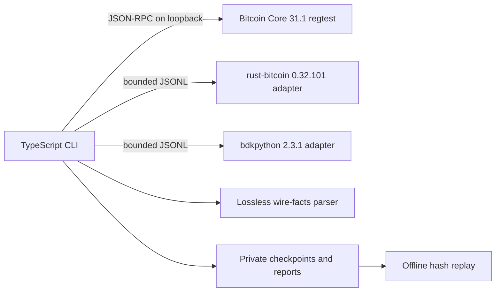

# Architecture

## Design Goal

The MVP answers one concrete question: can several real Bitcoin implementations hand the same PSBT
to one another and still produce a transaction that Bitcoin Core can finalize and accept under
policy? It does not reimplement wallet logic in TypeScript. The orchestrator controls the run while
each native library parses and acts on the PSBT itself.

## Components

### TypeScript orchestrator

The CLI owns scenario order, Core RPC, adapter lifecycle, strict request and response validation,
timeouts, result classification, artifact writing, and replay. TypeScript is used for developer
experience and orchestration; no signature algorithm is implemented there.

### Bitcoin Core fixture source and oracle

Core 31.1 mines a local regtest chain, funds the known public P2WSH descriptor, creates PSBTv0 with
`createpsbt`, and fills UTXO/script metadata with `utxoupdatepsbt`. At the end of each path,
`finalizepsbt` extracts the transaction and `testmempoolaccept` checks current consensus and mempool
policy without broadcasting it.

The Core RPC `version` argument to `createpsbt` is the unsigned transaction version. It is not the
PSBT format version. The generated fixture is inspected as PSBTv0 before any adapter receives it.

### Native adapters

Adapters speak `psbt-lab.adapter/0.1`, one JSON object per line. Every response repeats the request
ID and includes implementation name, version, and artifact digest. The status is one of `ok`,
`unsupported`, `rejected`, `crashed`, or `timeout`; failures use stable error classes rather than
language-specific stack traces.

The Rust adapter signs and finalizes only known fixture inputs. The Python adapter freezes the
affected `bdkpython` 2.3.1 wheel and exposes round-trip/finalize behavior. Neither adapter has
network access at runtime.

### Wire facts and artifacts

The wire-facts parser reads BIP174/BIP370 framing directly so serialization changes cannot be
hidden by a library's normalized object model. It records PSBT version, byte length, SHA256, map
counts, and key/value sizes. It does not include raw values in reports.

Each handoff writes both the canonical base64 PSBT and its facts. The manifest binds these files to
the run and implementation identities. Replay reparses each PSBT and compares hashes, so a shared
artifact can be validated without trusting the original terminal output.

## Proof Scenarios

### Happy path

1. Core builds one funded P2WSH input and one output.
2. Rust deserializes and serializes it byte-identically.
3. Rust signs the known input.
4. Core finalizes, extracts, and policy-checks the transaction.

### BDK finalization regression

1. Core builds a two-input P2WSH PSBT.
2. BDK round-trips it byte-identically.
3. Rust signs both inputs.
4. Rust finalizes input zero and removes metadata as a conforming finalizer may do; input one stays
   partially signed.
5. Frozen BDK 2.3.1 tries to finalize the already-finalized first input and returns the historical
   missing-witness-script failure.
6. Core finalizes the same mixed-state PSBT and policy-accepts the extracted transaction.

This is a synthetic minimal fixture based on the state transition described in BDK issue #488. It
does not copy the reporter's wallet data or seed.

## Extension Points

A grant-funded implementation can add adapters without changing scenario semantics. The next
interfaces should be a public adapter conformance kit, a declarative scenario format, transition
invariants, and a normalized diff model. New implementations can then be compared by capability and
version while raw PSBT bytes remain the source of truth.
