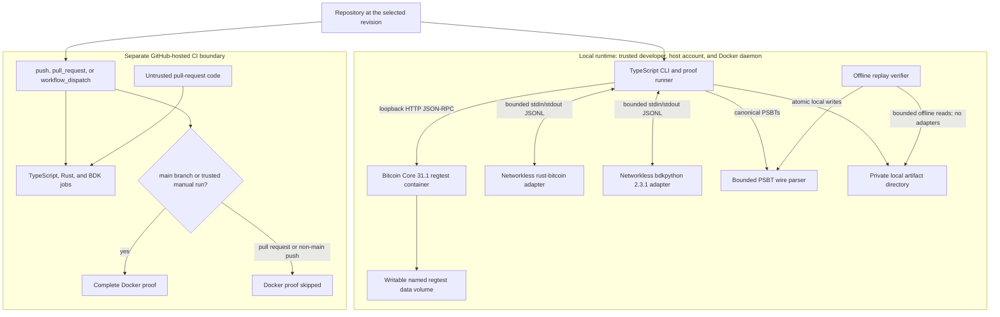

# PSBT Interop Lab Threat Model

## 1. Executive Summary

This model covers the local generated-regtest MVP and its separate GitHub-hosted build pipeline.
Under the confirmed assumptions, no high or critical runtime threat remains: one trusted developer
runs the CLI from a trusted host account and Docker daemon, and the signer uses only a public,
valueless regtest key. The main security objectives are proof-result integrity, containment of the
host, confidentiality of raw PSBT/script/UTXO artifact material, and bounded runtime and CI
execution.

The controls fail closed on malformed adapter messages, changed round-trip PSBT bytes, mismatched
Bitcoin Core RPC replies, an unexpected Core version, and replayed PSBT SHA256 mismatches. They do
not make this a production signer. Adapter identity is a compatibility self-report rather than
attestation: a malicious adapter can spoof the expected identity strings and supply any
schema-valid self-reported digest. Hashes stored in a mutable artifact manifest do not establish
authenticity.

## 2. Scope And Assumptions

### Local runtime boundary

The confirmed local assumptions are:

- One trusted developer runs the CLI locally.
- The suite creates every PSBT on isolated Bitcoin Core regtest.
- No arbitrary user PSBTs, mainnet signing, public API, web UI, uploads, or multi-tenancy.
- The local Docker daemon and host account are trusted.
- Artifacts remain local and may contain sensitive transaction metadata.

The trusted developer chooses the checkout, Docker images, RPC endpoint, and artifact directory.
The supported guarantee therefore excludes a malicious or compromised host account, Docker daemon,
kernel, or base image. Production keys and PSBTs, mainnet/testnet/signet use, hardware devices,
transaction broadcast, public services, and callers other than the one trusted developer are also
out of scope.

### GitHub CI boundary

GitHub-hosted CI is a separate build-time boundary: no secrets, read-only repository permission,
ephemeral runners, and the complete Docker proof only on trusted main-branch or manual runs.
Pull-request code is untrusted and runs only the TypeScript, Rust, and frozen BDK build/test jobs.
The workflow in `.github/workflows/ci.yml` supplies `contents: read`, disables persisted checkout
credentials, pins action revisions, sets per-job timeouts, and cancels superseded runs. A manual
Docker proof is assumed to target a revision selected by a trusted maintainer. This workflow does not
publish a release, attest an image, or make CI a runtime security boundary for the local CLI. The
controls mitigate credential, compute, and network abuse, but pull-request code can alter its own
tests and build scripts. A green run therefore shows revision self-consistency, not independent check
integrity.

## 3. System Model

The local components and their repository evidence are:

- The CLI in `src/cli.ts` validates commands and constructs the loopback-only `CoreRpc` client.
- `CoreRpc.call` in `src/core/rpc.ts` bounds request and response sizes, applies a timeout, and
  requires the returned JSON-RPC ID to equal the request ID.
- `prepareFixtures` in `src/core/fixtures.ts` requires regtest, zero peers, Bitcoin Core numeric
  version `310100`, and suite-generated PSBTv0 structure.
- The Rust adapter in `adapters/rust-bitcoin/` signs only the two known fixture policies. The BDK
  adapter in `adapters/bdkpython-2.3.1/` freezes the historical regression implementation.
- `AdapterProcess.request` in `src/protocol/adapter-process.ts` mediates one bounded JSONL request at
  a time, validates response schemas and IDs, and terminates on timeout or protocol violation.
- `extractWireFacts` in `src/psbt/wire-facts.ts` parses canonical, bounded PSBT framing independently
  of the native adapters.
- `ArtifactRun` in `src/runner/artifacts.ts` writes private checkpoint and report files atomically.
- `verifyReplay` in `src/runner/replay.ts` reparses each bounded PSBT and verifies its SHA256 against
  the manifest and the stored facts JSON `sha256`. It does not recompute other stored facts or
  recorded outcomes, and it does not rerun adapters.
- `.github/workflows/ci.yml` defines the separate hosted CI jobs and Docker-proof event gate.

## 4. Assets And Security Objectives

| Asset | Security objective | Evidence and limitation |
| --- | --- | --- |
| Proof outcome and checkpoints | Malformed round trips, mismatched RPC replies, and Core-rejected returned PSBTs must not produce PASS. | `runProof`, `assertByteIdenticalRoundtrip`, and `CoreRpc.call` enforce those checks. Core validation does not prove BDK executed or that later adapter operations preserved the intended unsigned transaction; see TM-001. |
| Host files and processes | Adapter and Core activity should remain within bounded containers and the selected local artifact directory. | `compose.yaml`, `createDockerAdapter`, and contained artifact paths reduce exposure. The host account, Docker daemon, and kernel remain trusted. |
| Artifact confidentiality | Raw PSBT, script, and UTXO material should remain out of reports. Implementation identity metadata is intentionally recorded. | `ArtifactRun` uses `0700` directories and `0600` files; those local permissions are the only protection for recorded identity metadata and checkpoint contents. Files are not encrypted from the trusted host account. |
| Local runner availability | Malformed or stalled adapters, Core replies, parsers, and replay input should have bounded time, memory, process, line, response, and file costs. | `AdapterProcess`, `CoreRpc`, `extractWireFacts`, `verifyReplay`, and container limits bound normal failure modes; a trusted-platform compromise is excluded. |
| CI runner availability and credentials | Untrusted pull-request code should have bounded hosted compute/network access and no repository write credential or workflow secret. | `.github/workflows/ci.yml` uses read-only permissions, no persisted checkout credential, job timeouts, and concurrency cancellation. Build scripts retain network access until a job ends. |
| CI check integrity | A result should accurately describe what the checked-out revision's own checks did. | Pull-request code can alter tests and build scripts, so green establishes revision self-consistency rather than independent check integrity. The workflow does not publish releases or attest artifacts/images. |

## 5. Attacker Model

Within the supported model, the runner treats these inputs or behaviors as potentially faulty or
hostile:

- A buggy or deliberately malformed adapter response, including a false `byteIdentical` field,
  wrong request ID, oversized output, invalid schema, stale implementation self-report, or hang.
- Accidental operator misconfiguration, such as a wrong Core endpoint, wrong Core version, attached
  peer, stale local image tag, unsuitable artifact path, or an untrusted container on Core's bridge.
- Corrupted local artifact files, including truncation, digest mismatch, absolute or lexically
  escaping paths, final-component symlinks on platforms where Node exposes `O_NOFOLLOW`, oversized
  files, or a manifest with excessive checkpoints. Intermediate symlinks remain trusted.
- Untrusted pull-request code running in the GitHub-hosted TypeScript, Rust, and BDK CI jobs and
  attempting to consume compute, inspect the public checkout, or misuse job network access.

The model does not claim protection against the trusted host account deliberately rewriting all
artifact files and hashes, a compromised Docker daemon or kernel escaping container controls, a
compromised base image or dependency source, or a maintainer deliberately running untrusted code in
a privileged environment. Those events violate the confirmed trust assumptions.

## 6. Entry Points And Attack Surfaces

| Boundary | Evidence path and symbol | Validation or containment | Remaining trust |
| --- | --- | --- | --- |
| Host to Bitcoin Core | `src/core/rpc.ts`: `CoreRpc.call` | HTTP only, loopback by default, bounded body/response, timeout, strict envelope, exact response ID | Local credentials and the selected Core/Docker runtime are trusted. |
| Core identity and fixtures | `src/core/fixtures.ts`: `prepareFixtures` | Requires regtest, zero connections, numeric version `310100`, and expected generated PSBTv0 structure | A compromised Core binary is not detected by these semantic checks. |
| Host to adapters | `src/protocol/adapter-process.ts`: `AdapterProcess.request` | `shell: false`, one in-flight JSONL request, schema and ID checks, 4 MiB line limit, 64 KiB retained stderr, timeout and termination | Adapter content remains untrusted until scenario checks consume it. |
| Adapter compatibility | `src/scenarios/contracts.ts`: `assertAdapterHello` | Pins self-reported name, version, source revision, operations, and PSBTv0 support | A malicious adapter can spoof the expected identity strings and supply any schema-valid self-reported digest; neither is image attestation. |
| Round-trip result | `src/scenarios/contracts.ts`: `assertByteIdenticalRoundtrip` | Parses both canonical PSBT values and compares decoded bytes independently of `byteIdentical` | It establishes byte equality, not which binary produced the response. |
| PSBT parser | `src/psbt/wire-facts.ts`: `extractWireFacts` | Pre-decode encoded-length check; canonical base64; 4 MiB PSBT, key/value, map, and entry bounds; structural framing | It does not interpret wallet intent or prove native-library memory safety. |
| Replay | `src/runner/replay.ts`: `verifyReplay` | Rejects absolute and lexically escaping paths; bounds manifest/files and checkpoint count; reparses each PSBT and verifies its SHA256 against the manifest and stored facts JSON `sha256` | Intermediate symlinks remain trusted. Final-component `O_NOFOLLOW` applies only where Node exposes it. Other facts/outcomes are not recomputed, and mutable hashes are not authenticity. |
| Artifact writes | `src/runner/artifacts.ts`: `ArtifactRun` | Safe identifiers, contained paths, exclusive temporary files, `fsync`, atomic rename, private modes | The trusted account can read or replace local artifacts; directory contents are not signed. |
| Containers | `compose.yaml` and `src/scenarios/proof.ts`: `createDockerAdapter` | Read-only roots, dropped capabilities, PID/memory limits, `no-new-privileges`; adapters have no network; Core keeps only its named data volume writable | Docker daemon, kernel, images, and an intentionally attached bridge container are trusted. |
| GitHub CI | `.github/workflows/ci.yml` | Read-only permission, no persisted checkout credential, pinned actions, ephemeral hosted jobs, timeouts, concurrency cancellation, Docker proof only on main/manual | Pull-request build code has job network/compute access; GitHub-host isolation and dependency services are external trust. |

## 7. Top Abuse Paths

1. **False PASS through adapter self-report.** An adapter can return `status: ok`, claim the expected
   identity, and set `byteIdentical: true`. `assertAdapterHello` rejects incompatible self-reported
   fields, while `assertByteIdenticalRoundtrip` independently parses and byte-compares the returned
   PSBT. Core validates returned PSBTs through finalization and policy checks, but this does not prove
   BDK executed or that later adapter operations preserved the intended unsigned transaction. A
   malicious binary can also spoof the expected identity strings and supply any schema-valid
   self-reported digest. False-PASS risk remains low only under the trusted-image scope.
2. **Mismatched or stale Core RPC reply.** A local endpoint could return a valid-looking result for a
   different request or run an unintended Core release. `CoreRpc.call` rejects a response ID that
   differs from its monotonically assigned request ID, and `prepareFixtures` requires version
   `310100`, regtest, zero peers, and expected PSBT structure before adapter execution.
3. **Oversized parser or replay input.** A response or modified artifact could try to force large
   allocations or long loops. Adapter lines, RPC bodies, PSBT encoded/decoded sizes, map entries,
   manifest bytes, checkpoint files, and replay checkpoint count are bounded. Residual work remains
   linear within those limits and is accepted for suite-generated local inputs.
4. **Container escape or resource exhaustion.** An adapter or Core process could fork, allocate, or
   write aggressively. PID/memory limits, read-only roots, dropped capabilities, and
   `no-new-privileges` reduce ordinary impact; adapters also have no network. Exploitation of the
   trusted Docker daemon, kernel, or base image is outside the supported guarantee.
5. **Mutable artifact tampering.** Replay reparses each PSBT and detects when its SHA256 differs from
   the manifest or the stored facts JSON `sha256`; it does not recompute other facts or outcomes. An
   editor controlling the artifact directory can replace the PSBT, facts, manifest hashes,
   scenarios, and outcome together. No external signature or immutable root exists. Absolute and
   lexically escaping paths are rejected, but intermediate symlinks remain trusted and final-component
   `O_NOFOLLOW` applies only where Node exposes it.
6. **CI compute, network, or credential abuse.** Pull-request code can execute package, compiler, and
   test commands on hosted runners. Read-only permissions, absent secrets, ephemeral jobs, timeouts,
   concurrency cancellation, and omission of the Docker proof mitigate those abuses. Pull-request
   code can alter its own tests and build scripts, so green means revision self-consistency rather
   than independent check integrity.

## 8. Threat Model Table

| ID | Asset | Preconditions | Abuse path | Impact | Controls | Residual risk | Status |
| --- | --- | --- | --- | --- | --- | --- | --- |
| TM-001 | Proof outcome and implementation compatibility | Adapter is buggy, stale, or lies in JSONL output | Self-reported identity, `byteIdentical`, or later adapter output creates a false PASS | Incorrect interoperability conclusion | `AdapterProcess.request` validates schema/ID/bounds; `assertAdapterHello` pins compatibility strings/capabilities; `assertByteIdenticalRoundtrip` independently parses and compares round-trip bytes; Core validates returned PSBTs through finalization and policy checks | Core validation does not prove BDK executed or that later adapter operations preserved the intended unsigned transaction. A malicious adapter can spoof the expected identity strings and supply any schema-valid self-reported digest. False-PASS risk is low only under the trusted-image scope. | Mitigated, low residual false-PASS risk under trusted-image scope |
| TM-002 | Core-derived fixture and policy result integrity | Wrong local Core instance or stale/mismatched reply | A response is associated with the wrong RPC request or unsupported Core version | Incorrect fixture or false result classification | `CoreRpc.call` requires exact response IDs and bounds transport; `prepareFixtures` requires regtest, zero peers, numeric version `310100`, and expected PSBTv0 structure | A compromised trusted Core binary can lie consistently and is outside the supported platform assumption. | Mitigated, low residual risk |
| TM-003 | Runner availability and parser integrity | Malformed adapter output or corrupted local replay data | Oversized base64, maps, values, files, output lines, RPC responses, or checkpoint lists consume memory/time | Local denial of service or incomplete proof | 4 MiB adapter/PSBT/file-class bounds, 8 MiB Core response bound, map/entry limits, timeouts, regular-file checks, and 1,000-checkpoint replay cap | Work and disk reads remain possible up to each cap; only suite-generated local inputs are supported. | Mitigated, low residual risk |
| TM-004 | Host containment and local availability | Containerized process is buggy or hostile; stronger case requires Docker/kernel compromise | Fork/memory/write abuse or attempted container escape | Host resource pressure or host compromise | Read-only roots, temporary `/tmp` for Core, dropped capabilities, PID/memory limits, `no-new-privileges`, networkless adapters, loopback-only Core RPC | Ordinary resource abuse is bounded with low residual risk. Docker daemon, kernel, and base-image compromise are not addressed by these controls. | Mitigated for resource use; Docker/kernel compromise out of scope |
| TM-005 | Artifact integrity and confidentiality | Local artifacts are corrupted or an actor can edit the artifact directory | Replace checkpoints, facts, manifest hashes, recorded scenarios, or path components | Misleading replay result or metadata disclosure | `ArtifactRun` uses atomic private writes; replay rejects absolute and lexically escaping paths, bounds reads, reparses PSBTs, and compares their SHA256 with manifest and stored facts JSON `sha256`; final-component `O_NOFOLLOW` is used where Node exposes it | Other facts/outcomes are not recomputed; intermediate symlinks remain trusted; hashes and outcomes share one unsigned mutable directory. Raw PSBT/script/UTXO material is excluded from reports, but recorded implementation identity metadata relies only on local permissions. | Accepted, low risk under trusted-local scope |
| TM-006 | CI availability and check integrity | Untrusted pull-request code executes in hosted jobs | Consume compute/network, seek credentials, or alter tests/build scripts | CI delay/cost or misleading PR signal | `contents: read`, no workflow secrets, `persist-credentials: false`, pinned actions, ephemeral runners, job timeouts, concurrency cancellation; Docker proof skipped for pull requests | Controls mitigate compute/network/credential abuse, but pull-request code controls its own checks. Green means revision self-consistency, not independent check integrity. GitHub runner isolation and registries are externally trusted. | Mitigated, low residual resource/credential risk; check independence not claimed |
| TM-007 | Real funds, production keys, users, or public services | The lab is extended or misused with arbitrary PSBTs, production keys, mainnet, uploads, hardware, public API/UI, or multiple tenants | Unsupported input reaches parser, native libraries, signing, storage, or policy decisions | Key/fund loss, privacy breach, or remote denial of service | Current CLI exposes only the generated proof suite; fixture key is public and valueless; Core is regtest/offline; no broadcast or public endpoint exists | No production-input, key-isolation, authentication, authorization, rate-limit, tenancy, hardware, or public-service guarantee is provided. | Out of scope; requires a new threat model |

## 9. Criticality Calibration

Runtime severity is calibrated to the confirmed local boundary, not to a general wallet or signing
service. The operator and host platform are trusted, PSBTs are generated by the suite, the only key
is public and valueless, Core is offline regtest, no transaction is broadcast, and artifacts stay
local. A successful attack within scope can primarily falsify a developer result, expose local test
metadata, or consume bounded local resources. Those consequences support low residual ratings after
the implemented checks; they do not support claims of production safety.

The CI boundary is assessed separately. Pull-request jobs execute untrusted code, but they receive no
workflow secrets or write permission, run on ephemeral hosted runners, and cannot invoke the complete
Docker proof through the pull-request event. Timeouts and concurrency cancellation bound ordinary
compute abuse. A CI PASS is not release or image attestation. Because the revision can alter its own
tests and build scripts, green means those revision-controlled checks were self-consistent; it does
not establish independent check integrity.

Accepting arbitrary or adversarial PSBTs, production keys, mainnet funds, public requests, uploads,
multiple tenants, or hardware devices would add assets and attackers absent here. Any such change
requires a new threat model and could raise integrity, confidentiality, availability, and fund-loss
severity materially.

## 10. Focus Paths

### Independent round-trip verification

1. `runProof` in `src/scenarios/proof.ts` sends a suite-generated PSBT through
   `AdapterProcess.request`, which applies schema, request-size, response-line, ID, and timeout checks.
2. `assertAdapterHello` in `src/scenarios/contracts.ts` first checks the adapter's pinned
   compatibility self-report. This does not attest the running image.
3. For `roundtrip`, `assertByteIdenticalRoundtrip` requires an `ok` response and a returned PSBT. It
   does not stop at the adapter's `byteIdentical: true` field.
4. It calls `extractWireFacts` on both source and returned canonical base64 values, then compares the
   decoded buffers. A malformed or changed PSBT throws before the scenario can be classified PASS.
5. Subsequent returned PSBT states are passed to `CoreRpc.call` for `finalizepsbt` and
   `testmempoolaccept`. Core validates those returned states, but does not prove BDK executed or that
   later adapter operations preserved the intended unsigned transaction. False-PASS risk is retained
   as low only under the trusted-image scope.

### Replay PSBT-digest verification

1. `verifyReplay` resolves the artifact root with `realpath`, verifies it is a directory, and opens
   `manifest.json` with a 4 MiB limit.
2. Paths recorded in checkpoints must be relative and are rejected when resolution would lexically
   escape the canonical artifact root. Intermediate symlinks remain part of the trusted local
   boundary.
3. `parseManifest` checks the minimal schema and `verifyReplay` rejects more than 1,000 checkpoints.
4. `readRegularFile` opens the final component with `O_RDONLY | O_NOFOLLOW` where Node exposes that
   flag, then checks and reads through one `FileHandle`. This final-component protection does not
   cover intermediate symlinks.
5. Each PSBT is bounded, line-framed, and reparsed by `extractWireFacts`. Its computed SHA256 must
   equal both the manifest checkpoint's SHA256 and the `sha256` field in the stored facts JSON.
6. Replay returns the manifest's recorded outcome and scenarios without launching adapters. It does
   not recompute other stored facts or recorded outcomes, authenticate the mutable directory, or
   prove the identity of the original producer.

### Untrusted pull-request CI flow

1. `pull_request` in `.github/workflows/ci.yml` checks out untrusted proposed code on a fresh
   GitHub-hosted runner. Top-level `permissions: contents: read` and `persist-credentials: false`
   prevent workflow repository writes through the checkout credential; the workflow supplies no
   secrets.
2. Exact action commit pins prepare Node, pnpm, or Python. Lockfiles and requirement hashes constrain
   selected dependencies, while registries and the hosted platform remain external trust.
3. The TypeScript, Rust, and BDK jobs execute build/test commands with 10- or 15-minute timeouts.
   Workflow concurrency cancels superseded runs for the same workflow/ref. Pull-request code can
   alter those test and build scripts, so green means revision self-consistency rather than
   independent check integrity.
4. The `docker-proof` job condition permits only `workflow_dispatch` or `refs/heads/main` and is false
   for a pull-request merge ref, so untrusted pull-request code does not receive the Docker proof
   boundary.
5. The runner is discarded after the job. The controls mitigate credential, network, and compute
   abuse; residual access before timeout is accepted as low within the no-secret, read-only,
   ephemeral CI scope.
